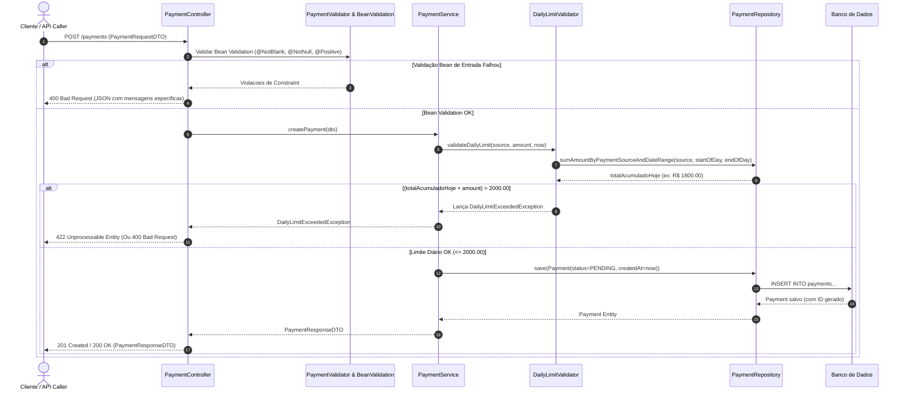
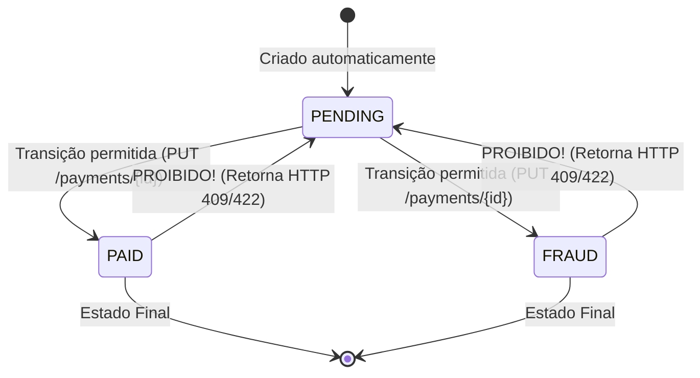
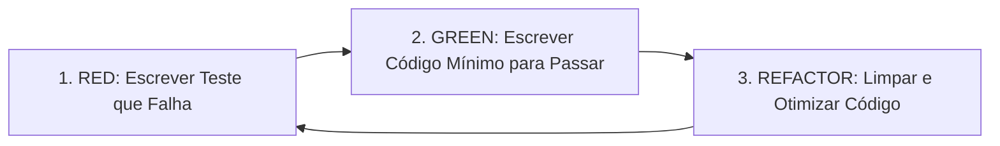

# Especificação Técnica de Software: Payment Service

> **Épico**: Processamento de Pagamento com Limite Diário por Fonte  
> **Arquitetura**: Java / Spring Boot  
> **Abordagem de Desenvolvimento**: Test-Driven Development (TDD)  
> **Pacote Base**: `com.eliasnogueira.paymentservice`  

---

## 1. Visão Geral e Contexto

O **Payment Service** é um microsserviço responsável pelo gerenciamento completo do ciclo de vida de transações financeiras. O objetivo principal do épico é permitir a criação, consulta, listagem e atualização de status de pagamentos com controle rigoroso de qualidade de dados e aplicação de um **limite diário acumulado de R$ 2.000,00 por fonte de pagamento** (`paymentSource`), garantindo integridade operacional, segurança antifraude e previsibilidade.

---

## 2. Requisitos Funcionais e Histórias de Usuário (User Stories)

### US-01: Criar um Novo Pagamento
- **Como** usuário do sistema de pagamentos
- **Eu quero** criar um pagamento informando o valor, a fonte de pagamento (`PIX`, `DEBIT_CARD`, `CREDIT_CARD`), o `transactionId` e o `payerId`
- **Para que** ele seja validado, submetido à regra de limite diário e registrado com status inicial `PENDING`.

#### Regras de Negócio:
1. Os campos obrigatórios no payload de criação são: `transactionId`, `paymentSource`, `amount` e `payerId`.
2. O valor (`amount`) deve ser estritamente positivo (`amount > 0.00`).
3. O status inicial de qualquer pagamento criado deve ser **`PENDING`**.
4. A data/hora de criação (`createdAt`) deve ser registrada automaticamente pelo sistema no momento da persistência.
5. **Limite Diário por Fonte**: A soma dos valores de todos os pagamentos criados no dia corrente (considerando o fuso horário oficial `UTC` ou local configurado da 00:00:00 às 23:59:59) para a mesma `paymentSource` **não pode ultrapassar R$ 2.000,00**.
   - O novo pagamento só é aceito se: $\text{soma\_atual} + \text{valor\_novo} \le 2000.00$.
   - Se a soma exceder R$ 2.000,00, a transação deve ser recusada imediatamente.

---

### US-02: Consultar um Pagamento por ID
- **Como** usuário do sistema
- **Eu quero** consultar um pagamento informando seu número de identificação (`id`)
- **Para** visualizar as informações completas da transação.

#### Regras de Negócio:
1. Cada pagamento possui um ID numérico único sequencial.
2. Ao informar um ID existente, o sistema deve retornar 200 (OK) com todos os detalhes.
3. Caso o pagamento não exista, o sistema deve informar claramente que o pagamento não foi encontrado.

---

### US-03: Listar Todos os Pagamentos
- **Como** analista ou gestor financeiro
- **Eu quero** visualizar todos os pagamentos realizados no sistema
- **Para** ter uma visão geral das operações financeiras.

#### Regras de Negócio:
1. Deve retornar uma lista contendo todos os pagamentos cadastrados.
2. A ordenação da lista deve seguir a data de criação (`createdAt`) em ordem cronológica (padrão crescente ou decrescente).
3. Caso o banco esteja vazio / não existam pagamentos, o sistema deve retornar 200 (OK) com uma lista vazia `[]`, sem gerar erro.

---

### US-04: Listar Pagamentos por Pagador
- **Como** analista de fraude ou gestor
- **Eu quero** visualizar todos os pagamentos realizados por um pagador específico (`payerId`)
- **Para** monitorar e analisar o histórico operacional daquele cliente.

#### Regras de Negócio:
1. O endpoint deve filtrar apenas os pagamentos cujo `payerId` seja igual ao informado na requisição (`GET /payer/{id}`).
2. A ordem da lista deve seguir a data de criação (`createdAt`).
3. Se não houver pagamentos para o pagador informado, o sistema deve retornar 200 (OK) com uma lista vazia `[]`.

---

### US-05: Atualizar o Status de um Pagamento
- **Como** equipe de operação financeira ou antifraude
- **Eu quero** alterar o status de um pagamento existente
- **Para** refletir o andamento real da transação (ex.: confirmação ou suspeita de fraude).

#### Regras de Negócio:
1. Os status válidos no domínio são: `PENDING`, `PAID`, `FRAUD`.
2. **Matriz de Transição Irrevogável**:
   - `PENDING` $\rightarrow$ `PAID` (Permitido)
   - `PENDING` $\rightarrow$ `FRAUD` (Permitido)
   - `PAID` $\rightarrow$ `PENDING` (**PROIBIDO**)
   - `FRAUD` $\rightarrow$ `PENDING` (**PROIBIDO**)
   - Um pagamento marcado como `PAID` ou `FRAUD` é considerado finalizado e **NUNCA** pode retornar para o status `PENDING`.
3. Se o ID informado não existir, retornar 404 (Not Found).
4. Se o novo status for nulo, ausente ou não pertencer ao Enum, retornar 400 (Bad Request).
5. Se for intentada uma transição proibida, o sistema deve recusar com erro de negócio (409 Conflict ou 422 Unprocessable Entity).

---

### US-06: Garantir a Qualidade das Informações (Validações de Entrada)
- **Como** responsável pela integridade dos dados
- **Eu quero** garantir que os pagamentos sejam sempre criados com dados corretos e validados
- **Para** evitar inconsistências, cadastros inválidos e falhas operacionais.

#### Regras de Validação e Mensagens Específicas:
1. `transactionId` nulo ou em branco $\rightarrow$ Mensagem: `"Transaction ID is required"` (HTTP 400).
2. `paymentSource` nulo ou inválido $\rightarrow$ Mensagem: `"Payment source is required"` (HTTP 400).
3. `amount` nulo ou $\le 0.00$ $\rightarrow$ Mensagem: `"Amount must be positive"` (HTTP 400).
4. Em qualquer erro de validação (simples ou múltiplos campos), a API deve retornar um JSON padronizado detalhando cada erro.

---

## 3. Especificação da API REST (Contratos HTTP)

### 3.1 Endpoints

| Método | Endpoint | Descrição | Status de Sucesso | Status de Erro Possíveis |
| :--- | :--- | :--- | :--- | :--- |
| `POST` | `/payments` | Cria um novo pagamento | `201 Created` / `200 OK` | `400 Bad Request`, `422 Unprocessable Entity` |
| `GET` | `/payments/{id}` | Consulta pagamento por ID | `200 OK` | `404 Not Found` |
| `GET` | `/payments` | Lista todos os pagamentos | `200 OK` | - |
| `GET` | `/payer/{id}` | Lista pagamentos por ID do pagador | `200 OK` | - |
| `PUT` | `/payments/{id}` | Atualiza o status do pagamento | `200 OK` | `400 Bad Request`, `404 Not Found`, `409/422` |

---

### 3.2 Schemas de Payload (JSON)

#### 1. Criar Pagamento (`POST /payments`)
**Request Body**:
```json
{
  "transactionId": "TX-998811",
  "paymentSource": "PIX",
  "amount": 250.50,
  "payerId": "PAYER-123"
}
```

**Response Body (`201 Created` / `200 OK`)**:
```json
{
  "id": 1,
  "transactionId": "TX-998811",
  "paymentSource": "PIX",
  "amount": 250.50,
  "status": "PENDING",
  "payerId": "PAYER-123",
  "createdAt": "2026-08-16T13:00:00Z"
}
```

---

#### 2. Atualizar Status (`PUT /payments/{id}`)
**Request Body**:
```json
{
  "status": "PAID"
}
```

**Response Body (`200 OK`)**:
```json
{
  "id": 1,
  "transactionId": "TX-998811",
  "paymentSource": "PIX",
  "amount": 250.50,
  "status": "PAID",
  "payerId": "PAYER-123",
  "createdAt": "2026-08-16T13:00:00Z"
}
```

---

#### 3. Payload de Erro Padronizado (`400 Bad Request` / `404` / `409` / `422`)
```json
{
  "timestamp": "2026-08-16T13:05:00Z",
  "status": 400,
  "error": "Bad Request",
  "message": "Validation failed for request",
  "errors": {
    "transactionId": "Transaction ID is required",
    "amount": "Amount must be positive"
  }
}
```

Para erros de recurso não encontrado (`404 Not Found`):
```json
{
  "timestamp": "2026-08-16T13:05:00Z",
  "status": 404,
  "error": "Not Found",
  "message": "Payment not found with ID: 99"
}
```

Para violação de regra de limite diário (`422 Unprocessable Entity` ou `400 Bad Request`):
```json
{
  "timestamp": "2026-08-16T13:05:00Z",
  "status": 422,
  "error": "Unprocessable Entity",
  "message": "Daily limit of 2000.00 exceeded for payment source PIX. Current total: 1800.00, Attempted: 300.00"
}
```

Para transição de status inválida (`409 Conflict` ou `422 Unprocessable Entity`):
```json
{
  "timestamp": "2026-08-16T13:05:00Z",
  "status": 409,
  "error": "Conflict",
  "message": "Cannot change status from PAID back to PENDING"
}
```

---

## 4. Arquitetura de Pacotes e Estrutura do Projeto

Conforme diretrizes especificadas, o projeto seguirá rigorosamente a arquitetura em camadas abaixo:

```text
src
├── main
│   ├── java
│   │   └── com
│   │       └── eliasnogueira
│   │           └── paymentservice
│   │               ├── config
│   │               │   ├── OpenAPIConfig.java
│   │               │   └── JacksonConfig.java
│   │               ├── controller
│   │               │   ├── PaymentController.java
│   │               │   └── PayerController.java
│   │               ├── dto
│   │               │   ├── PaymentRequestDTO.java
│   │               │   ├── PaymentResponseDTO.java
│   │               │   ├── PaymentStatusUpdateDTO.java
│   │               │   ├── ErrorResponseDTO.java
│   │               │   └── FieldErrorDTO.java
│   │               ├── exceptions
│   │               │   ├── PaymentNotFoundException.java
│   │               │   ├── DailyLimitExceededException.java
│   │               │   ├── InvalidStatusTransitionException.java
│   │               │   └── GlobalExceptionHandler.java
│   │               ├── model
│   │               │   ├── Payment.java
│   │               │   ├── PaymentSource.java (Enum: PIX, DEBIT_CARD, CREDIT_CARD)
│   │               │   └── PaymentStatus.java (Enum: PENDING, PAID, FRAUD)
│   │               ├── repository
│   │               │   └── PaymentRepository.java
│   │               ├── service
│   │               │   ├── PaymentService.java
│   │               │   └── impl
│   │               │       └── PaymentServiceImpl.java
│   │               └── validator
│   │                   ├── PaymentValidator.java
│   │                   └── DailyLimitValidator.java
│   └── resources
│       ├── application.yml
│       └── db/migration (opcional: Flyway/Liquibase)
└── test
    └── java
        └── com
            └── eliasnogueira
                └── paymentservice
                    ├── unit
                    │   ├── service
                    │   │   └── PaymentServiceTest.java
                    │   ├── validator
                    │   │   └── DailyLimitValidatorTest.java
                    │   └── model
                    │       └── PaymentStatusTransitionTest.java
                    ├── integration
                    │   ├── repository
                    │   │   └── PaymentRepositoryTest.java
                    │   └── controller
                    │       ├── PaymentControllerTest.java
                    │       └── PayerControllerTest.java
                    └── end2end
                        └── PaymentFlowE2ETest.java
```

---

## 5. Diagramas de Fluxo de Dados e Transição de Status

### 5.1 Fluxo de Criação de Pagamento com Validação e Limite Diário (Mermaid)



---

### 5.2 Máquina de Estados de Transição de Status (Mermaid)



---

## 6. Estratégia de Desenvolvimento Guiado por Testes (TDD)

A abordagem TDD (**Test-Driven Development**) é o pilar obrigatório do desenvolvimento desta aplicação. O ciclo de desenvolvimento deve seguir a disciplina estrita do **Red-Green-Refactor**:



### 6.1 Matriz de Cobertura e Especificação de Testes (TDD Suite)

Para garantir cobertura de 100% dos requisitos de negócio e casos de borda, a suíte de testes será estruturada conforme as especificações detalhadas na tabela a seguir:

| ID Caso de Teste | Camada / Classe Alvo | Cenário (Given / When / Then) | Resultado Esperado |
| :--- | :--- | :--- | :--- |
| **CT-01** | `PaymentValidatorTest` | **Given** `transactionId` nulo ou em branco<br>**When** submetido à validação<br>**Then** rejeitar | Retorna mensagem `"Transaction ID is required"` |
| **CT-02** | `PaymentValidatorTest` | **Given** `paymentSource` nulo<br>**When** submetido à validação<br>**Then** rejeitar | Retorna mensagem `"Payment source is required"` |
| **CT-03** | `PaymentValidatorTest` | **Given** `amount` $\le 0$<br>**When** submetido à validação<br>**Then** rejeitar | Retorna mensagem `"Amount must be positive"` |
| **CT-04** | `DailyLimitValidatorTest` | **Given** total acumulado no dia de R$ 1.500,00 para PIX<br>**When** tentar criar pagamento de R$ 500,00<br>**Then** aprovar ($\text{total} = 2000.00$) | Pagamento aceito sem exceção |
| **CT-05** | `DailyLimitValidatorTest` | **Given** total acumulado no dia de R$ 1.800,00 para PIX<br>**When** tentar criar pagamento de R$ 200,01<br>**Then** rejeitar ($\text{total} = 2000.01 > 2000.00$) | Lança `DailyLimitExceededException` |
| **CT-06** | `DailyLimitValidatorTest` | **Given** total acumulado de R$ 2.000,00 para CREDIT_CARD no dia anterior<br>**When** criar pagamento de R$ 1.000,00 no dia atual<br>**Then** aprovar | Pagamento aceito (limite ressetado por dia) |
| **CT-07** | `PaymentServiceTest` | **Given** payload de criação válido<br>**When** `createPayment` executado<br>**Then** criar pagamento | Status retornado é `PENDING` e `createdAt` preenchido |
| **CT-08** | `PaymentStatusTransitionTest` | **Given** pagamento com status `PENDING`<br>**When** atualizar status para `PAID`<br>**Then** permitir | Status atualizado para `PAID` com sucesso |
| **CT-09** | `PaymentStatusTransitionTest` | **Given** pagamento com status `PAID`<br>**When** tentar atualizar status para `PENDING`<br>**Then** proibir | Lança `InvalidStatusTransitionException` |
| **CT-10** | `PaymentStatusTransitionTest` | **Given** pagamento com status `FRAUD`<br>**When** tentar atualizar status para `PENDING`<br>**Then** proibir | Lança `InvalidStatusTransitionException` |
| **CT-11** | `PaymentControllerTest` | **Given** `GET /payments/{id}` com ID inexistente<br>**When** endpoint executado<br>**Then** retornar HTTP 404 | Payload contendo `"Payment not found with ID: {id}"` |
| **CT-12** | `PaymentControllerTest` | **Given** `GET /payments` com banco sem registros<br>**When** endpoint executado<br>**Then** retornar HTTP 200 | Retorna array JSON vazio `[]` |
| **CT-13** | `PayerControllerTest` | **Given** `GET /payer/{id}` para pagador sem transações<br>**When** endpoint executado<br>**Then** retornar HTTP 200 | Retorna array JSON vazio `[]` |
| **CT-14** | `PaymentRepositoryTest` | **Given** 3 pagamentos salvos em horários distintos<br>**When** buscar todos os pagamentos<br>**Then** ordenar por `createdAt` | Retorna lista ordenada cronologicamente |

---

## 7. Decisões de Arquitetura (ADRs)

### ADR 001: Isolamento do Cálculo de Limite Diário por Consulta Agregada em Banco de Dados
- **Contexto**: A regra de limite diário exige a soma dos pagamentos criados no dia corrente por `paymentSource`.
- **Decisão**: Criar um método customizado no `PaymentRepository`:
  `sumAmountByPaymentSourceAndCreatedAtBetween(PaymentSource source, LocalDateTime startOfDay, LocalDateTime endOfDay)`.
- **Consequência**: Evita carregar todas as entidades para a memória da JVM, realizando a agregação diretamente no SGBD (`SELECT SUM(p.amount) FROM Payment p WHERE ...`), otimizando performance e reduzindo footprint de memória.

### ADR 002: Truncamento Fuso Horário Local / UTC para Início e Fim de Dia
- **Contexto**: O limite diário é zerado à meia-noite (00:00:00).
- **Decisão**: O `DailyLimitValidator` utilizará `ZonedDateTime` ou `LocalDateTime` normalizado em `UTC` para computar a janela `[startOfDay, endOfDay]` correspondente a `00:00:00.000` até `23:59:59.999999999`.
- **Consequência**: Garante consistência temporal independente do servidor onde o serviço esteja rodando.

### ADR 003: Validação de Transição de Status no Domínio Encapsulado
- **Contexto**: Impedir alterações ilícitas de status de `PAID` ou `FRAUD` de volta para `PENDING`.
- **Decisão**: Encapsular a regra de transição dentro da própria entidade `Payment` ou através de um método de domínio `payment.changeStatus(newStatus)`, lançando `InvalidStatusTransitionException` caso a regra seja violada.
- **Consequência**: Garante que o modelo de domínio proteja seus próprios invariantes, seguindo princípios de Rich Domain Model / Clean Architecture.

---

## 8. Riscos, Condições de Corrida e Riscos Antifraude

1. **Condição de Corrida no Limite Diário (Race Conditions)**:
   - *Risco*: Requisições concorrentes simultâneas (ex: 2 requisições de R$ 1.500,00 enviadas exatamente no mesmo milissegundo para a mesma fonte com limite zerado) podem ler o mesmo total acumulado (R$ 0,00) e ambas aprovarem, resultando em R$ 3.000,00.
   - *Mitigação Sugerida*: Utilizar **Pessimistic Locking** ou **Distributed Lock** (ex: Redis/DB lock por `paymentSource` e data) ou uma transação isolada `SERIALIZABLE` durante a checagem e inserção do pagamento.

2. **Garantia de Resposta para Erros de Validação em Lote**:
   - *Risco*: Em requisições com múltiplos campos inválidos, retornar apenas o primeiro erro confunde a experiência do desenvolvedor/cliente.
   - *Mitigação*: O `GlobalExceptionHandler` deve capturar `MethodArgumentNotValidException` e agregar todos os erros em um mapa `errors: { "campo": "mensagem" }`.

---

## 9. Próximos Passos de Execução

1. **Implementação Guiada por TDD**:
   - Criar primeiro as classes de teste de unidade na estrutura `src/test/java/com/eliasnogueira/paymentservice/...`
   - Implementar incrementalmente as classes de modelo, DTO, repositório, serviço e controller para fazer os testes passarem.
2. **Execução da Suíte Completa**:
   - Rodar `mvn clean verify` e validar relatórios SpotBugs/PMD/Jacoco.
