# UniPDS Tests & Payment Service - Backend Java Spring Boot com Java 21, TDD & Data-Driven Testing (DDT)

🇧🇷 Português | 🇺🇸 English

---

## 🇧🇷 Português

### 📋 Visão Geral
O **UniPDS Tests** é um backend Java construído com **Spring Boot 3.3.11** e **Java 21**, estruturado em arquitetura limpa em camadas (Controllers, Services, Repositories, Models e Validators). O projeto inclui a implementação completa do **Payment Service**, desenvolvido sob a metodologia **TDD (Test-Driven Development)** para processamento de pagamentos com controle de limite diário acumulado e uma arquitetura avançada de **Data-Driven Testing (DDT)** com JUnit 5.

Principais destaques:
- **Payment Service (TDD)**: Processamento de pagamentos com validação de limite diário acumulado de **R$ 2.000,00** por fonte (`PIX`, `DEBIT_CARD`, `CREDIT_CARD`).
- **Arquitetura Data-Driven Testing (DDT)**: Estrutura dedicada sob subpacotes `*.ddt` em todas as camadas da aplicação, utilizando anotações JUnit 5 (`@ValueSource`, `@CsvSource`, `@MethodSource`, `@ArgumentsSource`).
- **Validação Arquitetural (ArchUnit)**: Suíte dedicada de testes de arquitetura (`HygieneRulesTest`, `PersistenceBoundariesRulesTest`, `RepositoryAccessRulesTest`, `StereotypeAndNamingRulesTest`, `GeneralRulesTest`) para enforcement automático de padrões de projeto.
- **Testes Automatizados (271 Casos - 100% Sucesso)**: Suíte robusta cobrindo testes unitários, validações de domínio, testes de arquitetura, manipuladores globais de exceção, repositórios, serviços, controllers e testes de integração com **Testcontainers MySQL**.
- **Cobertura de Código (JaCoCo)**: Relatórios detalhados de cobertura de instrução e código via `jacoco-maven-plugin`.
- **OpenAPI 3.0 & Swagger UI**: Documentação interativa da API REST.
- **Collection do Postman**: Collection pronta para importação e execução de requisições.
- **Qualidade & Análise Estática**: Análise contínua com **SpotBugs**, **PMD** e **SonarQube Community**.

---

## 🛠️ Tecnologias Utilizadas
- **Java 21**: Linguagem principal (LTS).
- **Spring Boot 3.3.11**: Framework backend.
- **Spring Data JPA**: Abstração de persistência relacional com Hibernate ORM.
- **Springdoc OpenAPI (v2.5.0)**: Geração de documentação Swagger UI.
- **JUnit 5 (Jupiter)**: Framework de testes automatizados e suítes parametrizadas Data-Driven Testing.
- **ArchUnit (v1.3.0)**: Framework de validação e testes de governança arquitetural (fronteiras de persistência, acesso de pacotes, convenção de nomes e higiene de código).
- **Mockito & AssertJ**: Mocking de dependências e asserções fluentes.
- **Datafaker (v2.5.3)**: Geração dinâmica de dados de teste realistas (nomes, endereços, CPFs válidos, credenciais) no locale `pt-BR`.
- **JaCoCo (v0.8.12)**: Cobertura e métricas de execução de testes.
- **Testcontainers & MySQL 9.2.0**: Containers Docker efêmeros para testes de integração com banco de dados relacional real.
- **H2 Database**: Banco em memória para execução ultrarrápida de testes de unidade e repositório.
- **SpotBugs, PMD & SonarQube**: Ferramentas de análise estática e qualidade de código.
- **Oracle FREE / MySQL / MS SQL Server**: Ambientes de persistência relacional.
- **Docker & Docker Compose**: Orquestração dos serviços da aplicação e SonarQube.
- **Maven**: Gerenciamento de dependências, ciclo de vida e build.

---

## 📐 Padrão Data-Driven Testing (DDT) com JUnit 5

Para garantir alta manutenibilidade, cobertura extensiva de cenários de borda e separação limpa da massa de testes, adotamos o padrão **Data-Driven Testing (DDT)** através de subpacotes dedicados `*.ddt` em todas as camadas da aplicação:

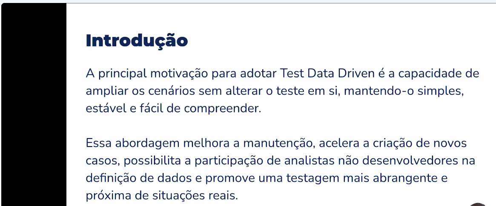

> **Figura 1**: *Conceito e motivação do Data-Driven Testing (DDT): expansão de cenários sem alterar o código dos testes, garantindo manutenibilidade e flexibilidade.*

### Estrutura de Pacotes DDT
```text
src/test/java/
├── com/artantech/paymentservice/
│   ├── architecture/           # HygieneRulesTest, PersistenceBoundariesRulesTest, RepositoryAccessRulesTest, StereotypeAndNamingRulesTest, GeneralRulesTest
│   ├── controller/ddt/         # PaymentControllerDataDrivenTest
│   ├── data/                   # PaymentDataFactory, PaymentDataFactoryTest
│   ├── exceptions/ddt/         # GlobalExceptionHandlerDataDrivenTest
│   ├── model/ddt/              # PaymentDataDrivenTest
│   ├── repository/ddt/         # PaymentRepositoryDataDrivenTest
│   ├── service/ddt/            # PaymentServiceImplDataDrivenTest
│   └── validator/ddt/          # DailyLimitValidatorDataDrivenTest
└── com/unipds/tests/
    ├── controller/ddt/         # CarroControllerDataDrivenTest, UsuarioControllerDataDrivenTest
    ├── factory/                # UserDataFactory, UserDataFactoryTest
    ├── model/ddt/              # CarroDataDrivenTest, UsuarioDataDrivenTest
    ├── repository/ddt/         # CarroRepositoryDataDrivenTest, UsuarioRepositoryDataDrivenTest
    └── service/ddt/            # CarroServiceDataDrivenTest, UsuarioServiceDataDrivenTest, ValueSourceTest, DataFakerExampleTest
```

### Técnicas Parametrizadas Utilizadas:
1. **`@ValueSource`**: Testes com arrays de primitivos, Strings ou Enums (ex: validação de faixas etárias de votação, IDs numéricos e status).
2. **`@CsvSource`**: Matrizes de dados tabulares delimitados por vírgula para testes com múltiplos parâmetros de entrada e resultados esperados.
3. **`@MethodSource`**: Provedores estáticos que retornam `Stream<Arguments>` para construção de DTOs complexos e coleções.
4. **`@ArgumentsSource`**: Classes customizadas que implementam `ArgumentsProvider` para desacoplar a geração de dados da lógica de teste.

### 🎲 Geração Dinâmica de Dados com Datafaker

Para evitar acoplamento com dados estáticos e aumentar a aleatoriedade e o realismo dos cenários de teste, o projeto integra a biblioteca **Datafaker (v2.5.3)**. Com ela, geramos massas de dados dinâmicas no locale `pt-BR` (como nomes completos, endereços brasileiros, CPFs válidos e credenciais de acesso):

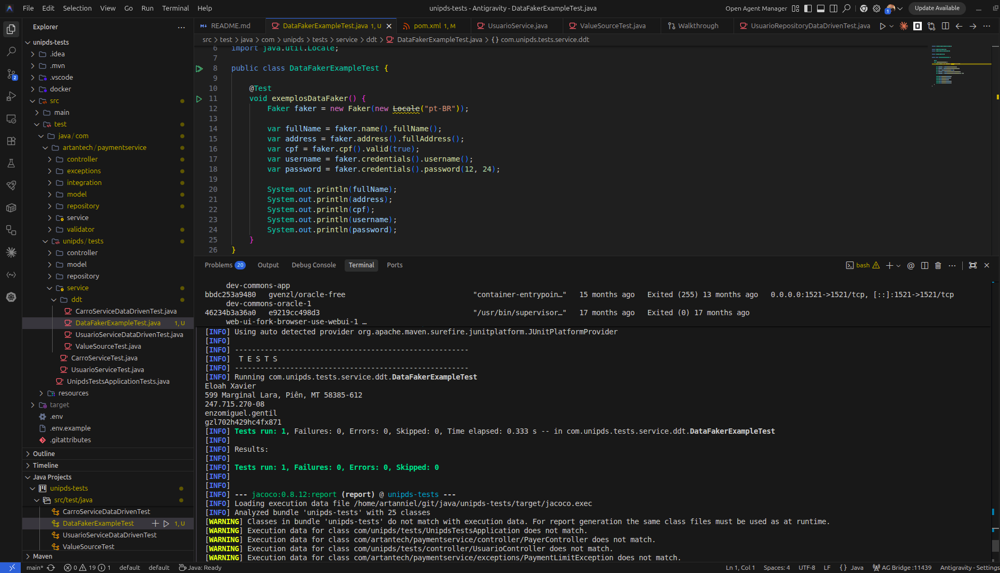

> **Figura**: *Execução do teste `DataFakerExampleTest` demonstrando a geração dinâmica e impressão de dados em tempo real (Nome, Endereço, CPF válido, Usuário e Senha).*

---

## 🏭 Padrão Test Data Factory

O **Test Data Factory** é um padrão de arquitetura para criação e gerenciamento centralizado de dados nos testes. Ele simplifica a manutenção da suíte, elimina a duplicação na montagem de objetos e garante desacoplamento entre os testes e os dados necessários para sua execução.

O **Test Data Factory** é composto por **três pilares fundamentais**:

```text
                     Test Data Factory
                             │
     ┌───────────────────────┼───────────────────────┐
     │                       │                       │
   Model                  Factory                Ferramenta
Classe (Model)        Classe aplicando        Ferramenta para
utilizada para        o pattern Factory       gerar os dados
guardar os dados      para gerar dados        randomizados (Datafaker)
```

1. **Model**: A classe ou estrutura que guarda os atributos necessários para o teste (ex: `User`, `Usuario`, `PaymentRequestDTO`).
2. **Factory**: A classe responsável por implementar o design pattern *Factory* (`UserDataFactory`), disponibilizando métodos de criação para diferentes cenários de teste (dados válidos, inválidos ou com limites de borda).
3. **Ferramenta**: A biblioteca de suporte (**Datafaker**) integrada à Factory para gerar atributos dinâmicos e contextualizados no locale correto (`pt-BR`).

### 💻 Exemplo de Implementação no Projeto

#### 1. Model (`User.java`)
```java
public class User {
    private String nome;
    private String email;
    private String senha;
    private String endereco;

    public static UserBuilder builder() {
        return new UserBuilder();
    }
    // Getters, Setters e Builder
}
```

#### 2. Factory (`UserDataFactory.java`)
```java
public final class UserDataFactory {

    private static final Faker faker = new Faker(Locale.forLanguageTag("pt-BR"));

    private UserDataFactory() {}

    public static User usuarioValido() {
        return User.builder()
                .nome(faker.name().fullName())
                .email(faker.internet().emailAddress())
                .senha(faker.credentials().password(8, 16))
                .endereco(faker.address().fullAddress())
                .build();
    }
}
```

#### 3. Factory para Payment Service (`PaymentDataFactory.java`)
```java
package com.artantech.paymentservice.data;

import com.artantech.paymentservice.model.PaymentRequest;
import com.artantech.paymentservice.model.PaymentSource;
import lombok.extern.slf4j.Slf4j;
import net.datafaker.Faker;

import java.math.BigDecimal;
import java.util.UUID;

@Slf4j
public final class PaymentDataFactory {

    private static final long MIN_VALID = 1L;
    private static final long MIN_INVALID = 2001L;
    private static final long MAX_VALID = 2000L;
    private static final long MAX_INVALID = 5000L;
    private static final int DECIMALS = 2;

    private static Faker faker = new Faker();

    private PaymentDataFactory() {}

    private static PaymentRequest basePaymentRequest() {
        var paymentRequest = PaymentRequest.builder()
                .payerId(UUID.randomUUID())
                .paymentSource(faker.options().option(PaymentSource.class))
                .amount(BigDecimal.valueOf(faker.number().randomDouble(DECIMALS, MIN_VALID, MAX_VALID)))
                .build();

        return paymentRequest;
    }

    public static PaymentRequest validPaymentRequest() {
        var paymentRequest = basePaymentRequest();
        log.info("Valid PaymentRequest created: {}", paymentRequest);
        return paymentRequest;
    }

    public static PaymentRequest invalidPaymentRequest() {
        var paymentRequest = basePaymentRequest();
        paymentRequest.setAmount(BigDecimal.valueOf(
                faker.number().randomDouble(DECIMALS, MIN_INVALID, MAX_INVALID)));

        log.info("Invalid PaymentRequest created: {}", paymentRequest);
        return paymentRequest;
    }
}
```

#### 4. Utilização nos Testes (`UserDataFactoryTest.java` / `PaymentDataFactoryTest.java`)
```java
@Test
void cadastrarUsuario() {
    var usuario = UserDataFactory.usuarioValido();

    assertThat(usuario).isNotNull();
    assertThat(usuario.getNome()).isNotBlank();
    assertThat(usuario.getEmail()).contains("@");
}

@Test
void criarPagamentoValido() {
    var request = PaymentDataFactory.validPaymentRequest();

    assertThat(request).isNotNull();
    assertThat(request.getAmount()).isGreaterThan(BigDecimal.ZERO);
}
```

---

## 🏛️ Validação Arquitetural & Governança com ArchUnit

Para garantir que a arquitetura em camadas do projeto permaneça limpa e imune a acoplamentos indevidos ou violações de boas práticas ao longo da evolução do sistema, o projeto integra o **ArchUnit (v1.3.0)** no ciclo automatizado de testes.

Todas as regras de governança estão concentradas no pacote `com.artantech.paymentservice.architecture`:

### 📋 Suítes de Teste de Arquitetura Implementadas:

1. **`HygieneRulesTest` (Higiene de Código)**:
   - `noGenericExceptionsShouldBeThrown`: Garante que nenhuma classe lance exceções genéricas (`Exception`, `Throwable`, `RuntimeException`), utilizando `GeneralCodingRules.NO_CLASSES_SHOULD_THROW_GENERIC_EXCEPTIONS`.
   - `shouldNotUseDeprecatedApi`: Impede a utilização de APIs, construtores ou métodos marcados como `@Deprecated`, utilizando `GeneralCodingRules.DEPRECATED_API_SHOULD_NOT_BE_USED`.

2. **`PersistenceBoundariesRulesTest` (Fronteiras de Persistência)**:
   - `entitiesTest`: Garante que todas as classes anotadas com `@Entity` (`jakarta.persistence.Entity`) pertençam estritamente ao pacote `model`.
   - `dtoTest`: Garante que classes dos pacotes `dto` e `controller` não possuam a anotação `@Entity`.

3. **`RepositoryAccessRulesTest` (Isolamento de Acesso a Repositórios)**:
   - `controllersTest`: Garante a separação de responsabilidades impedindo que a camada de `controller` acesse a camada de `repository` diretamente.
   - `repositoriesTest`: Garante que o pacote `repository` seja composto exclusivamente por `interfaces`.

4. **`StereotypeAndNamingRulesTest` (Estereótipos & Nomenclatura)**:
   - `controllersTest`: Garante que todas as classes anotadas com `@RestController` estejam localizadas no pacote `controller` e possuam nome terminando com o sufixo `Controller`.

5. **`GeneralRulesTest` (Regras de Governança do Payment Service)**:
   - Validações integradas de acoplamento de camadas, anotações de entidade e padrões de escrita de código.

---

## 🚀 Como Inicializar o Projeto

### 1. Pré-requisitos
- **Java 21** instalado (`java -version`)
- **Maven 3.8+** (ou utilizar o wrapper `./mvnw`)
- **Docker & Docker Compose** (necessário para Testcontainers MySQL, banco Oracle e SonarQube)

---

### 2. Inicialização em Modo Desenvolvimento

Para rodar a aplicação localmente utilizando o Spring Boot Maven Plugin:

```bash
./mvnw spring-boot:run
```

A aplicação iniciará na porta **8080** por padrão (`http://localhost:8080`).

---

### 3. Inicialização via JAR Compilado

```bash
# 1. Compilar e empacotar a aplicação
./mvnw clean package -DskipTests

# 2. Executar o JAR compilado
java -jar target/unipds-tests-0.0.1-SNAPSHOT.jar
```

---

### 4. Inicialização via Docker Compose (Com Banco Oracle)

```bash
# Executar o script automatizado de inicialização e ambiente Docker
./start_app.sh
```

---

## 🧪 Testes Automatizados & Relatórios JaCoCo

A suíte conta com **271 testes automatizados executados com 100% de sucesso** (incluindo validações de arquitetura com ArchUnit).

Comandos de execução de testes e geração de relatórios:

```bash
# Executar a suíte completa de 271 testes automatizados
./mvnw clean test

# Gerar relatório visual de cobertura de código com JaCoCo
./mvnw jacoco:report

# Executar a verificação de código com SpotBugs
./mvnw spotbugs:check

# Executar a fase completa de verificação (build + testes + cobertura + qualidade)
./mvnw clean verify
```

O relatório interativo em HTML do JaCoCo é gerado em: `target/site/jacoco/index.html`.

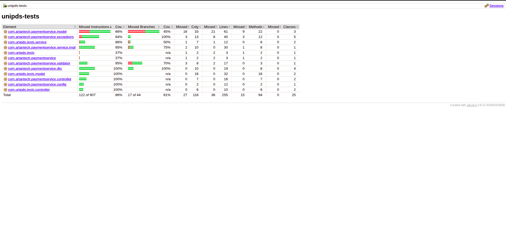

> **Figura 2**: *Relatório de cobertura do JaCoCo destacando taxas elevadas de cobertura por instrução (100% em controllers, DTOs, configs e modelos).*

---

## 🔍 Análise de Qualidade com SonarQube

O projeto inclui suporte integrado ao **SonarQube Community** para análise estática contínua e verificação de métricas de cobertura:

1. Subir a instância local do SonarQube (porta 9000):
   ```bash
   docker-compose -f docker-compose-sonarqube.yml up -d
   ```
2. Executar o script de análise automatizada:
   ```bash
   ./run_sonar.sh
   ```
3. Painel do SonarQube: [http://localhost:9000](http://localhost:9000)

### 📸 Evidências e Configurações do SonarQube

#### 1. Integração Build Maven + Importação JaCoCo + SonarQube
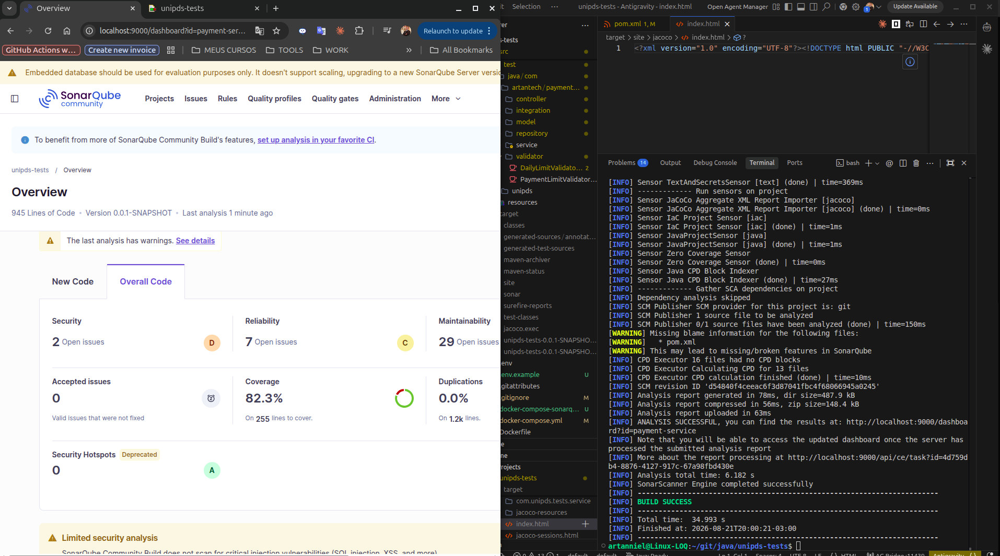
> **Figura 3**: *Execução do comando `mvn sonar:sonar` com importação automática do relatório XML do JaCoCo e sincronização com o painel SonarQube.*

#### 2. Configuração de Quality Gates Personalizados ("Artan Quality Gate")
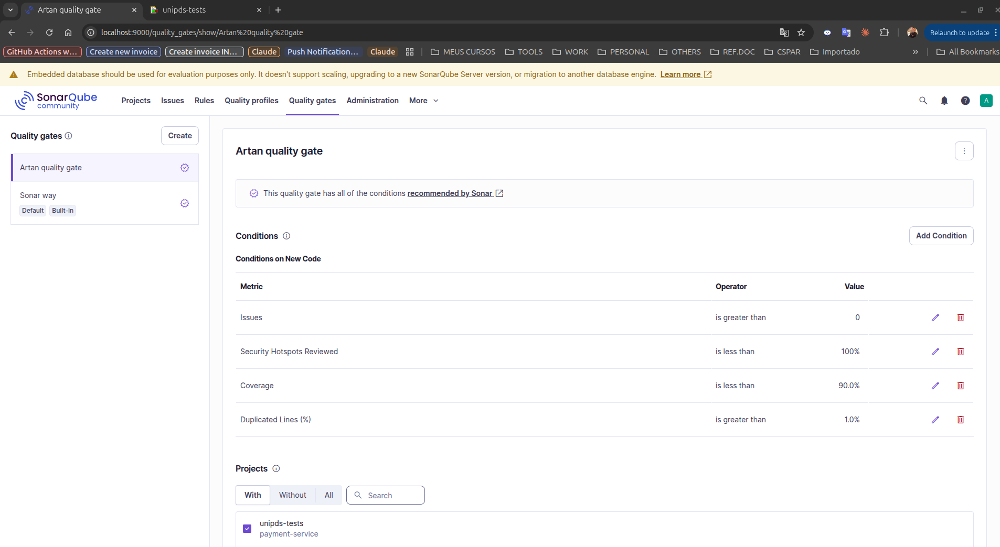
> **Figura 4**: *Definição de regras customizadas para o Quality Gate, como exigência de 90% de cobertura em código novo e limite zero de duplicidades.*

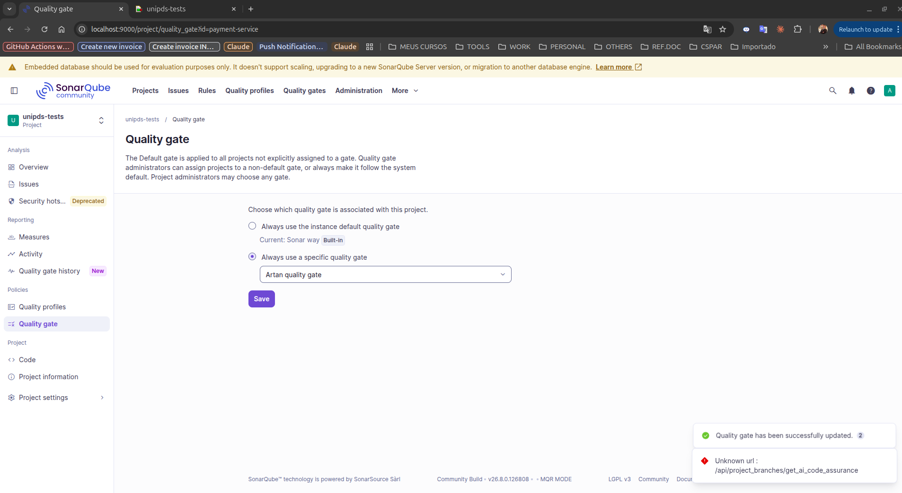
> **Figura 5**: *Associação do Quality Gate customizado ao projeto `unipds-tests`.*

#### 3. Autenticação Segura via Token
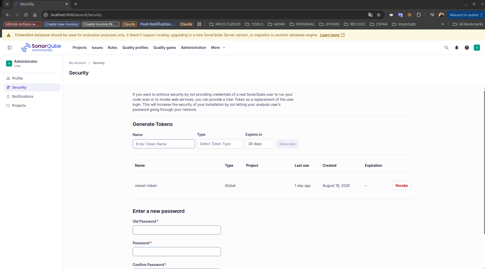
> **Figura 6**: *Geração do User Token (`maven-token`) no SonarQube para autenticação segura no script `./run_sonar.sh`.*

#### 4. Resultados da Análise & Aprovação no Quality Gate
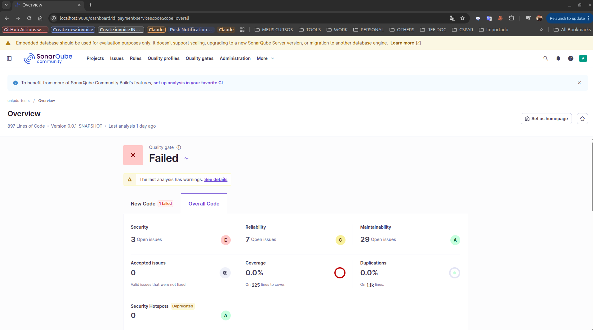
> **Figura 7**: *Estado inicial da análise antes da vinculação do relatório XML do JaCoCo.*

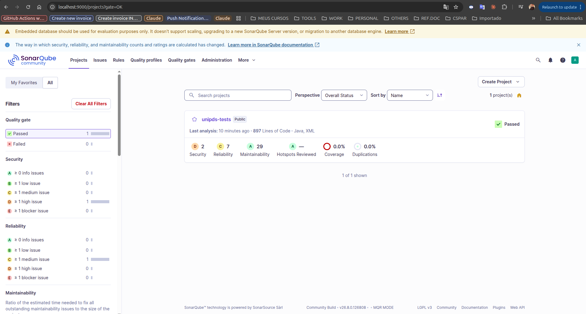
> **Figura 8**: *Painel do SonarQube com status **Passed** após atingir as métricas de qualidade e cobertura configuradas.*

#### 5. Gestão de Issues e Histórico de Análises
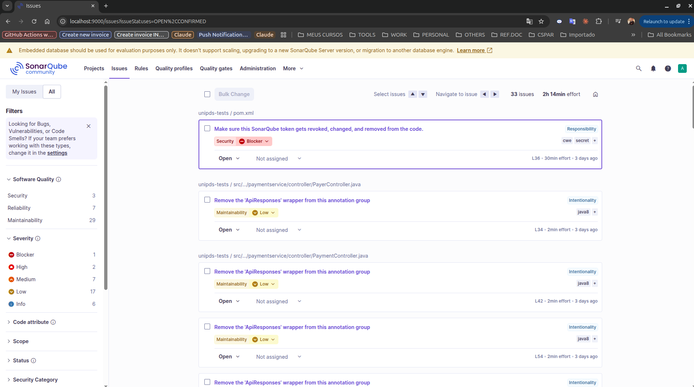
> **Figura 9**: *Detalhamento e acompanhamento de Code Smells, Bugs e Hotspots de segurança.*

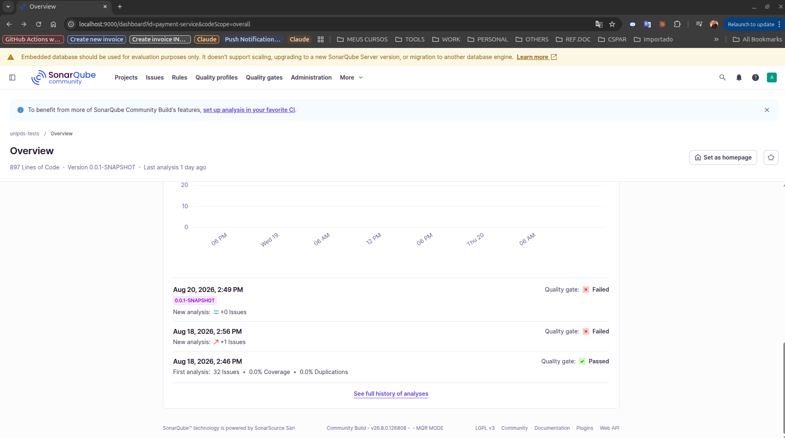
> **Figura 10**: *Histórico temporal de builds e evolução da qualidade do código.*

---

## 🛡️ Análise Estática Local (SpotBugs & PMD)

Além do SonarQube, o projeto possui integrações com **SpotBugs** e **PMD** no ciclo de vida do Maven para detectar problemas antes do commit:


> **Figura 11**: *Execução do SpotBugs integrado ao plugin `maven-site-plugin`.*


> **Figura 12**: *Execução de `mvn spotbugs:spotbugs` no VS Code Terminal.*

---

## 📖 Documentação da API

- **Swagger UI Interativo**: [http://localhost:8080/swagger-ui.html](http://localhost:8080/swagger-ui.html)
- **OpenAPI 3.0 JSON**: [http://localhost:8080/v3/api-docs](http://localhost:8080/v3/api-docs)
- **Arquivo OpenAPI Local**: [`openapi.json`](file:///home/artanniel/git/java/unipds-tests/openapi.json)
- **Postman Collection**: [`Payment_Service.postman_collection.json`](file:///home/artanniel/git/java/unipds-tests/Payment_Service.postman_collection.json)

---

## 📍 Endpoints da API (`/payments`)

| Método | Endpoint | Descrição | Status de Sucesso |
| :--- | :--- | :--- | :--- |
| `POST` | `/payments` | Criar novo pagamento (status inicial `PENDING`) | `201 Created` |
| `GET` | `/payments/{id}` | Consultar pagamento por ID | `200 OK` |
| `GET` | `/payments` | Listar todos os pagamentos ordenados por data | `200 OK` |
| `PUT` | `/payments/{id}` | Atualizar status (`PAID` ou `FRAUD`) | `200 OK` |
| `GET` | `/payer/{id}` | Consultar pagamentos por ID do pagador | `200 OK` |

---

## 🇺🇸 English

### 📋 Overview
**UniPDS Tests & Payment Service** is a Java 21 backend application built on **Spring Boot 3.3.11** following **TDD** and structured **Data-Driven Testing (DDT)** architecture using JUnit 5 features (`@ValueSource`, `@CsvSource`, `@MethodSource`, `@ArgumentsSource`).

Key Features:
- **271 Automated Test Cases** with 100% pass rate.
- **ArchUnit (v1.3.0)** architecture & governance testing suite (`HygieneRulesTest`, `PersistenceBoundariesRulesTest`, `RepositoryAccessRulesTest`, `StereotypeAndNamingRulesTest`, `GeneralRulesTest`).
- **Datafaker (v2.5.3)** integration for dynamic, realistic test data generation (names, addresses, valid CPFs, credentials).
- Dedicated `*.ddt` subpackage structure across all application layers.
- **JaCoCo** code coverage reporting (`target/site/jacoco/index.html`).
- **Testcontainers MySQL 9.2.0** integration tests.
- **SonarQube Community** code analysis support via `./run_sonar.sh`.
- **Swagger UI & OpenAPI 3.0** documentation.

### 🚀 Quick Start & Testing

```bash
# Run full automated test suite (271 tests)
./mvnw clean test

# Generate JaCoCo coverage report
./mvnw jacoco:report

# Run application
./mvnw spring-boot:run
```

---
